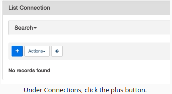

# Data Pipeline of Sparkify

A music streaming company, Sparkify, has decided that it is time to introduce more automation and monitoring to their data warehouse ETL pipelines and come to the conclusion that the best tool to achieve this is Apache Airflow.

# Prerequisites:

- Create an IAM User in AWS.
- Create a Redshift role
- Configure Redshift Serverless in AWS.
- Install Aiflow (v2.10.2)

# Setting up Connections

### **Airflow and AWS Redshift**

To create a connection betweem AWS Redshift with Airflow is necessary first a create a Redshift Serveles (cluster) and to do the cluster setup to accept connections by Airflow.
After done the Redshift serveless setup through Airflow UI. This is done 
create a connection in the Connections window. Following the example:

1. To go to the Airflow UI:
    Once you see the message "Airflow web server is ready" click on the blue Access Airflow button in the bottom right.
2. Click on the Admin tab and select Connections.

3. Under Connections, select Create.

4. In AWS Redshift Serverless Dashboard, click the default Workgroup

5.Get the endopoint of cluster: 

6. On the Airflow create connection page, enter the following values:

**Connection Id**: Enter redshift.
**Connection Type**: Choose Amazon Redshift.
**Host**: Enter the endpoint of your Redshift Serverless workgroup, excluding the port and schema name at the end. You can find this by selecting your workgroup in the Amazon Redshift console. See where this is located in the screenshot below. IMPORTANT: Make sure to NOT include the port and schema name at the end of the Redshift endpoint string.
**Schema**: Enter dev. This is the Redshift database you want to connect to.
**Login**: Enter awsuser.
**Password**: Enter the password you created when launching Redshift serverless.
**Port**: Enter 5439. Once you've entered these values, select Save.

Ex:

# Project Instructions

# Datasets
For this project, you'll be working with two datasets. Here are the s3 links for each:

Log data: s3://udacity-dend/log_data
Song data: s3://udacity-dend/song-data

# Copy S3 Data (?)

# Project Template

The project template package contains three major components for the project:
The dag template has all the imports and task templates in place, but the task dependencies have not been set
The operators folder with operator templates
A helper class for the SQL transformations

#DAG Graph in the Project Template
here are 9 tasks in the project template's DAG graph that exist independently: Begin_execution, Load_artist_dim_table, Load_song_dim_table, Load_songplays_fact_table, Load_time_dim_table, Load_user_dim_table, Run_data_quality_checks, Stage_events, and Stage_songs. 

Configuring the DAG

In the DAG, add default parameters according to these guidelines

The DAG does not have dependencies on past runs
On failure, the task are retried 3 times
Retries happen every 5 minutes
Catchup is turned off
Do not email on retry
In addition, configure the task dependencies so that after the dependencies are set, the graph view follows the flow shown in the image below.

Completed DAG Dependencies Image Description
The Begin_execution task should be followed by both Stage_events and Stage_songs. These staging tasks should both be followed by the task Load_songplays_fact_table. Completing the Load_songplays_fact_table should trigger four tasks at the same time: Load_artist_dim_table, Load_song_dim_table, Load_time_dim_table, and Load_user_dim_table. After completing all of these four tasks, the task Run_dadta_quality_checks_should_run. And, finally, run the Stop_execution task.

Building the operators falar deles

Stage Operator

Fact and Dimension Operators

Data Quality Operator

implementar uma função que check valores nullos 

cria link para o projeto 2