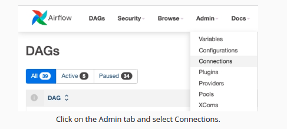

# Data Pipeline of Sparkify

A music streaming company, Sparkify, has decided that it is time to introduce more automation and monitoring to their data warehouse ETL pipelines and come to the conclusion that the best tool to achieve this is Apache Airflow.


# Prerequisites:

- Create an IAM User in AWS.
- Create a Redshift role
- Configure Redshift Serverless in AWS.
- Install Aiflow (v2.10.2)

# Setting up Connections


### **Airflow and AWS Redshift**

To create a connection betweem AWS Redshift with Airflow is necessary first a create a Redshift Serveles (cluster) and to do the cluster setup to accept connections by Airflow.
After done the Redshift serveless setup through Airflow UI. This is done 
create a connection in the Connections window. Following the example:

1. To go to the Airflow UI:
    Once you see the message "Airflow web server is ready" click on the blue Access Airflow button in the bottom right.
2. Click on the Admin tab and select Connections.



3. Under Connections, select Create.


4. In AWS Redshift Serverless Dashboard, click the default Workgroup


5.Get the endopoint of cluster: 


6. On the Airflow create connection page, enter the following values:

**Connection Id**: Enter redshift.

**Connection Type**: Choose Amazon Redshift.

**Host**: Enter the endpoint of your Redshift Serverless workgroup, excluding the port and schema name at the end. You can find this by selecting your workgroup in the Amazon Redshift console. See where this is located in the screenshot below. IMPORTANT: Make sure to NOT include the port and schema name at the end of the Redshift endpoint string.

**Schema**: Enter dev. This is the Redshift database you want to connect to.

**Login**: Enter awsuser.

**Password**: Enter the password you created when launching Redshift serverless.

**Port**: Enter 5439. Once you've entered these values, select Save.


Ex:


# Datasets

For this project, it was worked two datasets. Here are the s3 links for each:

Log data: **s3://udacity-dend/log_data**
Song data: **s3://udacity-dend/song-data**

**Hit**:It is a good idea create your own bucket and transfer this data to him

# DAG's Configuration

In the DAG, there are some *default parameters*:

 - The DAG does not have dependencies on past runs
- On failure, the task are retried 3 times
- Retries happen every 5 minutes
- Catchup is turned off
- Do not email on retry


# Operators 

This data pepline is made up for three operators: *Stage Operator*,*Fact Operator*,*Dimensions Operator* and *Data Quality Operator*

This data pipeline is basead on this project [The Sparkify](https://github.com/karllabatista/udacity_sparkify_dw_project2). So to more information aboute the fact and dimensions table can be found there.

**Note**: Before executing this data pipeline in necessary to create stage and final tables.
In the  directory root there utils/create_tables.py that create all tables. See the script and configure it to run.

### Stage Operator

This operator make transfer data from S3 buckes to Redshift stages tables. And it capable load any JSON-formatted files (static and dynamics paths)

### Fact and Dimension Operators

Fact tables are loaded by this operator.
This operator executes a sql statement to load the fact table with transformed data.

The same thing happen with Dimensions table. Although, the insert method is runned with truncate-insert mode or appendy-only mode. If the truncate-insert mode is choose every insertion the table will be erased and after be loaded. In other hand, the appendy-only will insert more row to exist table.


### Data Quality Operator

The final operator to create is the data quality operator, which runs checks on the data itself. The operator's main functionality is to receive one or more SQL based test cases along with the expected results and execute the tests. For each test, the test result and expected result need to be checked, and if there is no match, the operator should raise an exception, and the task should retry and fail eventually.

## How to run
### Prerequistes

To run the dag is necessary change the path of DAGs in *airflow.cfg*. And search for "*dags_folder*" variable. See the example below:

*dags_folder = /home/udacity/airflow/dags/project/udacity_sparkify_data_pipeline_with_airflow_project_4*


**Run in a terminal**

```python

# create a virtual environment
python3 -m venv env

#activate virtual environment
source env/bin/activate

#install minimal prerequisites
pip3 install -r requirements.txt

#execute the scheduler
airflow scheduler
```

**Run in in other terminal**

```python
#opeN the Airflow UI
airflow webserver
```